  

  
  

 

[cto-legends](https://github.com/avalonreset/cto-legends) coordinates an expanding ecosystem of open-source tools through a single agent skill. a capability index resolves tasks to specialized markdown instructions; versioned installations, isolated runtimes, and readiness checks support execution through command-line tools and service APIs. [legends-empire](https://github.com/avalonreset/legends-empire) provides the knowledge layer: a navigable ontology of your infrastructure, projects, evidence, and decisions. the objective is cumulative capability: agents that can operate your tools, retrieve prior knowledge, and continue building without reconstructing your world every session.

  multi service provider agnostic compatibility:
  
  
  
  
  
  
  
  

---

### the ecosystem

<table width="100%"><tr>
<td width="277" valign="top"><a href="https://github.com/avalonreset/cto-legends"><strong><code>cto-legends</code></strong></a> &nbsp;&lt;--- install</td>
<td width="220" valign="top"><strong>single-skill-router</strong></td>
<td width="703" valign="top">central capability index, module manager, and execution router.</td>
</tr></table>

<table width="100%">
<tr><th width="276" align="left"></th><th width="204" align="left"></th><th width="720" align="left"></th></tr>
<tr><td valign="top"><a href="https://github.com/avalonreset/legends-empire"><strong>legends-empire</strong></a></td><td valign="top">digital ontology</td><td valign="top">preserve source-cited research and update vault notes through recoverable transactions. unified empire workspace onboarding is in development.</td></tr>
<tr><td valign="top"><a href="https://github.com/avalonreset/legends-grant"><strong>legends-grant</strong></a></td><td valign="top">grant research</td><td valign="top">business grant discovery, eligibility research, matching, and application support.</td></tr>
<tr><td valign="top"><a href="https://github.com/avalonreset/legends-geogrid"><strong>legends-geogrid</strong></a></td><td valign="top">local maps SEO</td><td valign="top">open-source google maps rank checker: geographic search grids, local visibility matrices, street maps, and actionable client reports at raw dataforseo cost.</td></tr>
<tr><td valign="top"><a href="https://github.com/avalonreset/legends-dataforseo-kit"><strong>legends-dataforseo</strong></a></td><td valign="top">search data engine</td><td valign="top">high-throughput python client and CLI for dataforseo: SERP queues, keyword research, official API discovery, and reusable evidence export. no MCP server required.</td></tr>
<tr><td valign="top"><a href="https://github.com/avalonreset/legends-github"><strong>legends-github</strong></a></td><td valign="top">repo optimization</td><td valign="top">repository optimization suite for claude, codex, and gemini. audits repos, improves readme copy, tunes metadata, manages releases, and ensures community health.</td></tr>
<tr><td valign="top"><a href="https://github.com/avalonreset/legends-stable-audio-3"><strong>legends-stable-audio-3</strong></a></td><td valign="top">audio production</td><td valign="top">agent-operated stable audio 3: hardware-aware batch planning, continuous audio mixes, custom adapters, and sound effect generation.</td></tr>
<tr><td valign="top"><a href="https://github.com/avalonreset/legends-obs-kit"><strong>legends-OBS</strong></a></td><td valign="top">video recording</td><td valign="top">agent-operated OBS studio controller on windows: hardware inspection, scene and encoder planning, rollback snapshots, verified recording pipelines, and optional cursor overlay extra.</td></tr>
<tr><td valign="top"><a href="https://github.com/avalonreset/hyperyap"><strong>hyperyap</strong></a></td><td valign="top">local voice typing</td><td valign="top">native desktop dictation powered by NVIDIA parakeet: app-focused paste, custom vocabulary, configurable shortcuts, and local transcription.</td></tr>
<tr><td valign="top"><a href="https://github.com/avalonreset/legends-firecrawl"><strong>legends-firecrawl</strong></a></td><td valign="top">web research</td><td valign="top">unified firecrawl web operations and alexandria data intelligence with credit efficiency and automated IP safety routing.</td></tr>
<tr><td valign="top"><a href="https://github.com/avalonreset/legends-yt-dlp"><strong>legends-yt-dlp</strong></a></td><td valign="top">video capture</td><td valign="top">repeatable yt-dlp source pulls, verification, transcripts, search, and clip-building with pacing, bulk guardrails, and optional mullvad VPN.</td></tr>
<tr><td valign="top"><a href="https://github.com/avalonreset/legends-ambient-intelligence"><strong>legends-ambient-intelligence</strong></a></td><td valign="top">ambient audio</td><td valign="top">passive audio capture, deduplicated archiving, offline transcription, and vault distillation for voice memos and recorder ingest.</td></tr>
<tr><td valign="top"><a href="https://github.com/avalonreset/legends-ultimate-captions"><strong>legends-ultimate-captions</strong></a></td><td valign="top">video captions</td><td valign="top">agentic caption QA and rendering: contextual ASR correction, forced-alignment timing, active-word captions, proof frames, and revision memory.</td></tr>
</table>

---

  
  

---

- **website:** [cto-legends.com](https://cto-legends.com/) &lt;--- leave a voice message
- **pro community:** [ai-marketing-hub-pro](https://www.skool.com/ai-marketing-hub-pro)
- **free community:** [ai-marketing-hub](https://www.skool.com/ai-marketing-hub)
- **youtube:** [@avalonreset](https://www.youtube.com/@avalonreset)
- **linkedin:** [Benjamin Samar](https://www.linkedin.com/in/benjaminsamar/)
