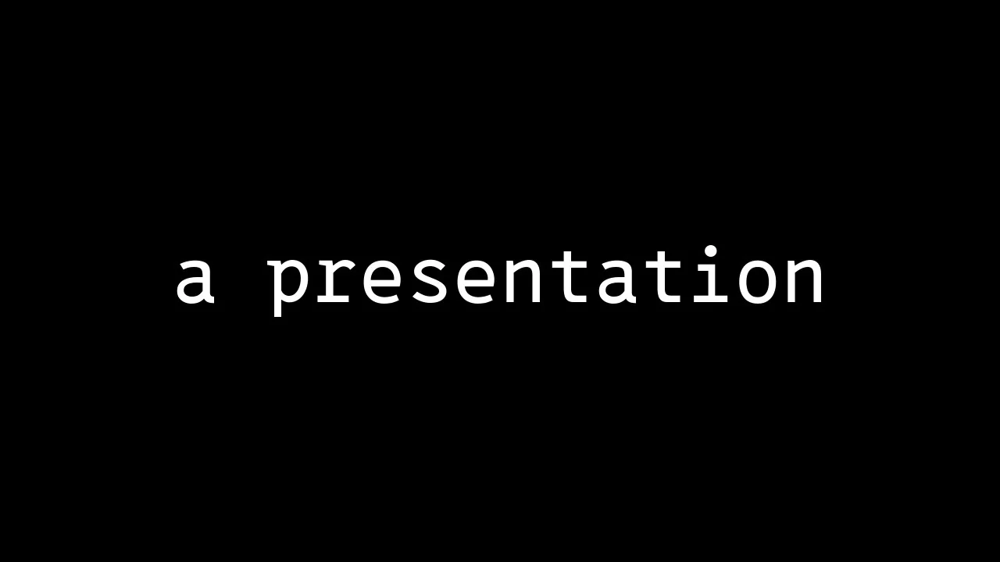
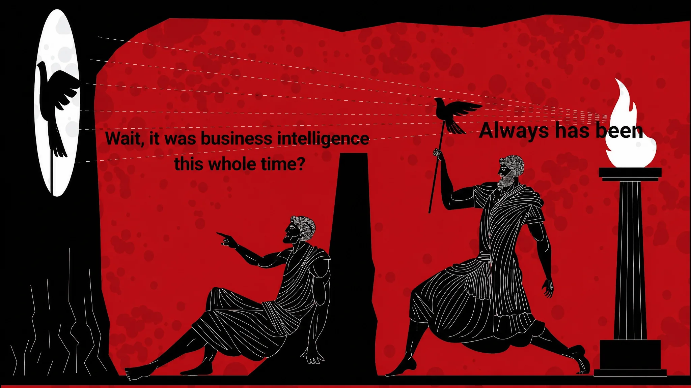

  

  
  

 

Modular AI agent skills, deterministic tool runtimes, and local intelligence systems.

The ecosystem combines independent modules with one central entry point, `cto-legends`. This is the single-skill router: install one skill; every module loads on demand. Agents load the relevant Markdown instructions on demand and use executable tools where needed. Setup and execution support depend on the module and agent application:

  
  
  
  
  
  
  
  

---

### Start with `cto-legends`

Give your agent the [cto-legends repository](https://github.com/avalonreset/cto-legends) and describe what you want to do. The central skill helps discover modules, load their instructions, and check their prerequisites.

- **One entry point:** the single-skill router; a capability index points to independent Markdown workflows.
- **Install what you need:** executable modules use their documented runtimes; some workflows need only instructions and available tools.
- **Check readiness:** installation, credentials, browser support, and task inputs are distinct checks.
- **Keep modules independent:** each product retains its own release and scope. Agent discovery and execution still depend on the host setup.

### The ecosystem

**The router: [`cto-legends`](https://github.com/avalonreset/cto-legends).** Install one skill; every module below loads on demand. Capability discovery, reviewed module installation, isolated executable environments, and Markdown workflow handoffs.

| Module | Focus | What you can do |
|---|---|---|
| **[legends-empire](https://github.com/avalonreset/legends-empire)** | Business & Research Memory | Preserve source-cited research and update vault notes through recoverable transactions. Unified Empire workspace onboarding is in development. |
| **[legends-grant](https://github.com/avalonreset/legends-grant)** | Grant Research | Business grant discovery, eligibility research, matching, and application support. |
| **[legends-geogrid](https://github.com/avalonreset/legends-geogrid)** | Local Maps SEO | Open-source Google Maps rank checker: geographic search grids, local visibility matrices, street maps, and actionable client reports at raw DataForSEO cost. |
| **[legends-dataforseo](https://github.com/avalonreset/legends-dataforseo-kit)** | Search Data Engine | High-throughput Python client and CLI for DataForSEO: SERP queues, keyword research, official API discovery, and reusable evidence export. No MCP server required. |
| **[legends-github](https://github.com/avalonreset/legends-github)** | Repo Optimization | Repository optimization suite for Claude, Codex, and Gemini. Audits repos, improves README copy, tunes metadata, manages releases, and ensures community health. |
| **[legends-stable-audio-3](https://github.com/avalonreset/legends-stable-audio-3)** | Audio Production | Agent-operated Stable Audio 3: hardware-aware batch planning, continuous audio mixes, custom adapters, and sound effect generation. |
| **[legends-obs](https://github.com/avalonreset/legends-obs-kit)** | Video Recording | Agent-operated OBS Studio controller on Windows: hardware inspection, scene and encoder planning, rollback snapshots, verified recording pipelines, and optional cursor overlay extra. |
| **[hyperyap](https://github.com/avalonreset/hyperyap)** | Local Voice Typing | Native desktop dictation powered by NVIDIA Parakeet: app-focused paste, custom vocabulary, configurable shortcuts, and local transcription. |
| **[legends-firecrawl](https://github.com/avalonreset/legends-firecrawl)** | Web Research | Unified Firecrawl web operations and Alexandria data intelligence with credit efficiency and automated IP safety routing. |

---

  
  

---

### Community & Resources

- **Website:** [cto-legends.com](https://cto-legends.com/)
- **Pro Community:** [AI Marketing Hub Pro](https://www.skool.com/ai-marketing-hub-pro)
- **Free Community:** [AI Marketing Hub](https://www.skool.com/ai-marketing-hub)
- **YouTube:** [@avalonreset](https://www.youtube.com/@avalonreset)
- **LinkedIn:** [Benjamin Samar](https://www.linkedin.com/in/benjaminsamar/)
