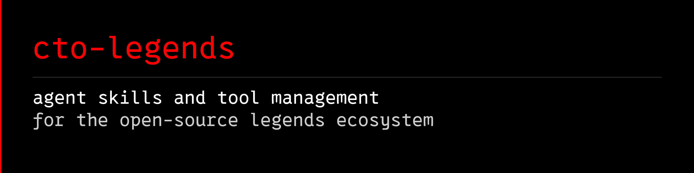

<div align="center">
  <a href="https://cto-legends.com">
    
  </a>
</div>

<p align="center">
  <a href="https://github.com/avalonreset/cto-legends"></a>
  <a href="https://cto-legends.com"></a>
  <a href="https://github.com/avalonreset/cto-legends/blob/main/LICENSE"></a>
  <a href="https://www.skool.com/ai-marketing-hub-pro"></a>
</p>

---

### The Legends Open-Source Ecosystem

Modular AI agent skills, deterministic tool runtimes, and local intelligence systems.

Instead of monolithic frameworks or brittle MCP middleware, the Legends ecosystem provides independent, single-purpose software tools. Each module features a deterministic CLI, dedicated runtime isolation, and portable skill definitions built for **Claude Code, Codex, Gemini CLI, Grok, and Cursor**.

---

### The Master Coordinator: cto-legends

You do not need to manually configure, clone, or keep track of dozens of independent repositories.

All you have to do is grab **[cto-legends](https://github.com/avalonreset/cto-legends)**.

`cto-legends` is the master coordinator for the entire ecosystem. It inspects what you want to build, locates the right module, installs verified releases into isolated virtual environments, and injects native agent skills into your workstation.

- **Autonomous Routing:** Tell your agent what you want to achieve. `cto-legends` routes the task to the exact verified module.
- **Isolated Environments:** Every Python and Node module runs in its own isolated environment. Zero dependency conflicts.
- **Portable Agent Skills:** Registers uniform skill definitions directly into Claude Code, Codex, Gemini, Grok, and Cursor.
- **Runtime Verification:** Built-in `cto-legends doctor` audits local hardware, system libraries, and CLI readiness before execution.

#### Quickstart

```bash
# 1. Install the cto-legends master coordinator (v0.3.0)
python -m pip install "https://github.com/avalonreset/cto-legends/releases/download/v0.3.0/cto_legends-0.3.0-py3-none-any.whl"

# 2. Register the routing skill with your chosen agent
cto-legends install-skill --directory ~/.agents/skills --apply

# 3. Route and install modules on demand
cto-legends route "Google Maps ranking grids"
cto-legends install legends-geogrid --apply
cto-legends doctor
```

Once installed, your agent can load specialized modules whenever a task demands them:

```bash
# Run modules through the coordinator without path friction
cto-legends run legends-geogrid -- --help
cto-legends run legends-dataforseo-kit -- routes
cto-legends run legends-github -- capabilities
```

---

### Core Public Modules

The primary public release set, available for immediate deployment:

| Module | Focus | Capabilities |
|---|---|---|
| **[cto-legends](https://github.com/avalonreset/cto-legends)** | Master Coordinator | Autonomous module discovery, isolated environment management, verified release downloads, and universal agent skill routing. |
| **[legends-geogrid](https://github.com/avalonreset/legends-geogrid)** | Local Maps SEO | Open-source Google Maps rank checker: geographic search grids, local visibility matrices, street maps, and actionable client reports at raw DataForSEO cost. |
| **[legends-dataforseo-kit](https://github.com/avalonreset/legends-dataforseo-kit)** | Search Data Engine | High-throughput Python client and CLI for DataForSEO: SERP queues, keyword research, official API discovery, and reusable evidence export. No MCP server required. |
| **[legends-github](https://github.com/avalonreset/legends-github)** | Repo Optimization | Repository optimization suite for Claude Code, Codex, and Gemini CLI. Audits repos, improves README copy, tunes metadata, manages releases, and ensures community health. |
| **[legends-stable-audio-3](https://github.com/avalonreset/legends-stable-audio-3)** | Audio Production | Agent-operated Stable Audio 3: hardware-aware batch planning, continuous audio mixes, custom adapters, and sound effect generation. |
| **[legends-obs-kit](https://github.com/avalonreset/legends-obs-kit)** | Video Recording | Agent-operated OBS Studio controller on Windows: hardware inspection, scene and encoder planning, rollback snapshots, and verified recording pipelines. |
| **[legends-obsidian](https://github.com/avalonreset/legends-obsidian)** | Knowledge Memory | Source-cited Obsidian vault memory: transactional note updates, research evidence graphs, and persistent recall for autonomous agent workflows. |
| **[hyperyap](https://github.com/avalonreset/hyperyap)** | Local Voice Typing | Native desktop dictation powered by NVIDIA Parakeet: app-focused paste, custom vocabulary, configurable shortcuts, and zero cloud latency. |
| **[legends-obs-cursor](https://github.com/cto-legends/legends-obs-cursor)** | Stream Visualizer | Momentum-aware animated cursor overlays, click halos, and visual effects for OBS Studio screencasts and presentations. |
| **[legends-seo-dungeon](https://github.com/avalonreset/legends-seo-dungeon)** | Gamified SEO Audit | Interactive terminal SEO audit where website technical defects, schema errors, and performance gaps are turned into 16-bit dungeon battles for agents. |

---

### Extended Legends Modular Arsenal

In addition to the core public releases, the ecosystem includes specialized tool kits and operational modules managed across the Legends architecture:

#### System Control, Surface & Optical Hands
- **`legends-chrome-kit`**: House browser transport and canvas tab stewardship. Multi-canvas navigation, deterministic DOM inspection, and verified optical feedback.
- **`legends-shell-kit`**: OS-level window placement, multi-monitor display geometry, canvas pinning, and silent background process supervision.
- **`legends-controller`**: Workstation bridging and authenticated hardware action dispatch across multi-machine setups.
- **`legends-ambient-intelligence`**: Continuous ambient audio capture and hardware-aware processing pipeline with local ASR memory.
- **`legends-windirstat-kit`**: Canvas-docked disk triage and direct WinDirStat index reading without recursive directory recrawls.

#### Media, Video & Narrative Intelligence
- **`legends-clip-hunter`**: Long-form video review corpus, automated moment detection, and editorial highlight selection.
- **`legends-yt-dlp-slayer`**: High-throughput media capture, transcript extraction, and video intelligence ingestion.
- **`legends-dramatica`**: Structural story and narrative engineering, beat generation, and scenario modeling.
- **`legends-blender-kit`**: Video Sequence Editor (VSE) automation and headless timeline rendering.
- **`legends-shotcut-kit`**: Scriptable video assembly and filter chain application.

#### Infrastructure & Workflow Automation
- **`legends-omnigent-kit`**: Multi-agent living office harness, room lifecycle management, peer coordination, and session checkpoints.
- **`legends-skool-kit`**: Skool community operations, member intelligence, automated classroom delivery, and CLI workflows.
- **`legends-n8n-kit`**: Headless n8n workflow management, webhook inspection, and agent-driven node configuration.
- **`legends-temporal-kit`**: Durable execution workflows, distributed task execution, and failure-proof state recovery.
- **`legends-coolify-kit`**: Self-hosted PaaS infrastructure automation, deployment pipelines, and container lifecycle CLI.
- **`legends-hetzner-kit`**: Always-on cloud server management and provisioning CLI for bare-metal and CX instances.
- **`legends-firecrawl-kit`**: Deep web extraction, clean markdown scraping, and LLM-ready crawl pipelines.
- **`legends-alexandria-kit`**: Knowledge provider discovery, API capability cataloging, and direct bypass routing.
- **`legends-gohighlevel-kit`**: CRM and agency automation facade with snapshot-free recovery.
- **`legends-whatsapp-kit`**: Desktop companion, conversational archive, and verified message handoffs.

---

### Agent Compatibility

All Legends modules are built agent-first with native CLI interfaces and standardized skill packages. They are battle-tested across:

- **Claude Code** (Anthropic)
- **Codex CLI / Desktop** (OpenAI)
- **Gemini CLI** (Google DeepMind)
- **Grok** (xAI)
- **Cursor**
- **MetaMuse**

---

### Community & Resources

- **Website:** [cto-legends.com](https://cto-legends.com/)
- **Pro Community:** [AI Marketing Hub Pro](https://www.skool.com/ai-marketing-hub-pro)
- **Free Community:** [AI Marketing Hub](https://www.skool.com/ai-marketing-hub)
- **YouTube:** [@avalonreset](https://www.youtube.com/@avalonreset)
- **LinkedIn:** [Benjamin Samar](https://www.linkedin.com/in/benjaminsamar/)
