<!-- HEADER:START -->
<p align="left">
  <a href="https://cto-legends.com/home"></a><!--
  --><a href="https://www.skool.com/ai-marketing-hub-pro"></a><!--
  --><a href="https://github.com/avalonreset/cto-legends"></a>
</p>
<!-- HEADER:END -->

<!-- CARDS:START -->
<p align="left">
  <a href="https://github.com/avalonreset/cto-legends">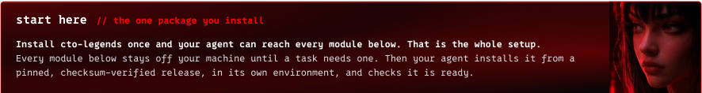</a>
  <a href="https://github.com/avalonreset/cto-legends#readme"></a><!--
  --><a href="https://github.com/avalonreset/cto-legends/releases"></a><!--
  --><a href="https://cto-legends.com/modules/cto-legends"></a><!--
  -->
</p>

```text
Set up https://github.com/avalonreset/cto-legends and check which modules apply to this workspace.
```

<p align="left">
  <!--
  --><a href="https://github.com/avalonreset/cto-legends#development-contributing-and-license"></a>
  <a href="https://github.com/avalonreset/legends-empire">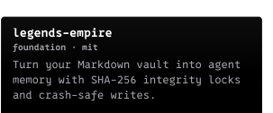</a><!--
  --><a href="https://github.com/avalonreset/legends-hetzner">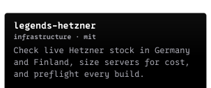</a><!--
  --><a href="https://github.com/avalonreset/legends-coolify">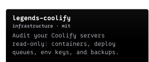</a>
  <a href="https://cto-legends.com/modules/legends-empire"></a><!--
  --><a href="https://github.com/avalonreset/legends-empire#readme"></a><!--
  --><a href="https://cto-legends.com/modules/legends-hetzner"></a><!--
  --><a href="https://github.com/avalonreset/legends-hetzner#readme"></a><!--
  --><a href="https://cto-legends.com/modules/legends-coolify"></a><!--
  --><a href="https://github.com/avalonreset/legends-coolify#readme"></a>
  <a href="https://github.com/avalonreset/legends-cloudflare">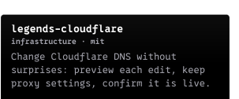</a><!--
  --><a href="https://github.com/avalonreset/legends-astro">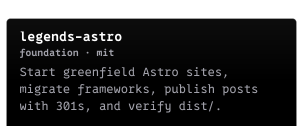</a><!--
  --><a href="https://github.com/avalonreset/legends-github">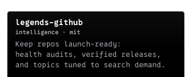</a>
  <a href="https://cto-legends.com/modules/legends-cloudflare"></a><!--
  --><a href="https://github.com/avalonreset/legends-cloudflare#readme"></a><!--
  --><a href="https://cto-legends.com/modules/legends-astro"></a><!--
  --><a href="https://github.com/avalonreset/legends-astro#readme"></a><!--
  --><a href="https://cto-legends.com/modules/legends-github"></a><!--
  --><a href="https://github.com/avalonreset/legends-github#readme"></a>
  <a href="https://github.com/avalonreset/legends-stripe">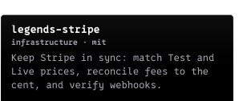</a><!--
  --><a href="https://github.com/avalonreset/legends-gohighlevel">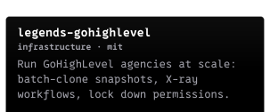</a><!--
  --><a href="https://github.com/avalonreset/legends-dataforseo">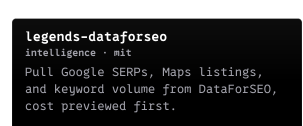</a>
  <a href="https://cto-legends.com/modules/legends-stripe"></a><!--
  --><a href="https://github.com/avalonreset/legends-stripe#readme"></a><!--
  --><a href="https://cto-legends.com/modules/legends-gohighlevel"></a><!--
  --><a href="https://github.com/avalonreset/legends-gohighlevel#readme"></a><!--
  --><a href="https://cto-legends.com/modules/legends-dataforseo"></a><!--
  --><a href="https://github.com/avalonreset/legends-dataforseo#readme"></a>
  <a href="https://github.com/avalonreset/legends-geogrid">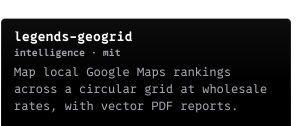</a><!--
  --><a href="https://github.com/avalonreset/legends-firecrawl">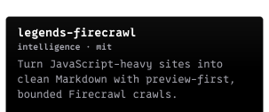</a><!--
  --><a href="https://github.com/avalonreset/legends-grant">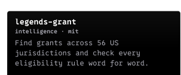</a>
  <a href="https://cto-legends.com/modules/legends-geogrid"></a><!--
  --><a href="https://github.com/avalonreset/legends-geogrid#readme"></a><!--
  --><a href="https://cto-legends.com/modules/legends-firecrawl"></a><!--
  --><a href="https://github.com/avalonreset/legends-firecrawl#readme"></a><!--
  --><a href="https://cto-legends.com/modules/legends-grant"></a><!--
  --><a href="https://github.com/avalonreset/legends-grant#readme"></a>
  <a href="https://github.com/avalonreset/legends-youtube">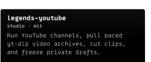</a><!--
  --><a href="https://github.com/avalonreset/legends-obs">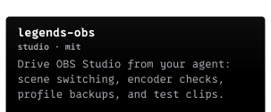</a><!--
  --><a href="https://github.com/avalonreset/legends-captions">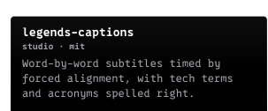</a>
  <a href="https://cto-legends.com/modules/legends-youtube"></a><!--
  --><a href="https://github.com/avalonreset/legends-youtube#readme"></a><!--
  --><a href="https://cto-legends.com/modules/legends-obs"></a><!--
  --><a href="https://github.com/avalonreset/legends-obs#readme"></a><!--
  --><a href="https://cto-legends.com/modules/legends-captions"></a><!--
  --><a href="https://github.com/avalonreset/legends-captions#readme"></a>
  <a href="https://github.com/avalonreset/legends-stable-audio-3">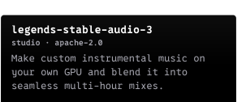</a><!--
  --><a href="https://github.com/avalonreset/legends-hyperyap">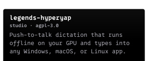</a><!--
  --><a href="https://github.com/avalonreset/legends-ambient-intelligence">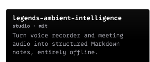</a>
  <a href="https://cto-legends.com/modules/legends-stable-audio-3"></a><!--
  --><a href="https://github.com/avalonreset/legends-stable-audio-3#readme"></a><!--
  --><a href="https://cto-legends.com/modules/legends-hyperyap"></a><!--
  --><a href="https://github.com/avalonreset/legends-hyperyap#readme"></a><!--
  --><a href="https://cto-legends.com/modules/legends-ambient-intelligence"></a><!--
  --><a href="https://github.com/avalonreset/legends-ambient-intelligence#readme"></a>
  <a href="https://github.com/avalonreset/legends-temporal">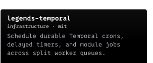</a><!--
  --><a href="https://github.com/avalonreset/legends-jev">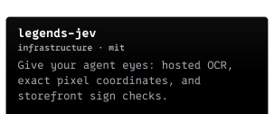</a><!--
  --><a href="https://github.com/avalonreset/legends-buzz">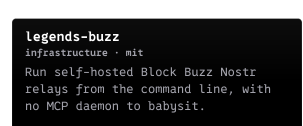</a>
  <a href="https://cto-legends.com/modules/legends-temporal"></a><!--
  --><a href="https://github.com/avalonreset/legends-temporal#readme"></a><!--
  --><a href="https://cto-legends.com/modules/legends-jev"></a><!--
  --><a href="https://github.com/avalonreset/legends-jev#readme"></a><!--
  --><a href="https://cto-legends.com/modules/legends-buzz"></a><!--
  --><a href="https://github.com/avalonreset/legends-buzz#readme"></a>
  <a href="https://github.com/stars/avalonreset/lists/cto-legends"></a>
</p>
<!-- CARDS:END -->
<!-- MEME:START -->
<p align="center">
  <a href="https://github.com/avalonreset/cto-legends#readme"></a><!--
  --><a href="https://cto-legends.com/home"></a>
</p>
<!-- MEME:END -->
